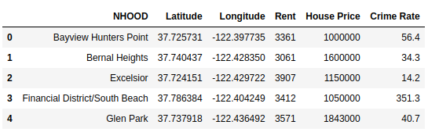
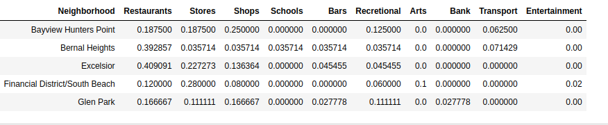
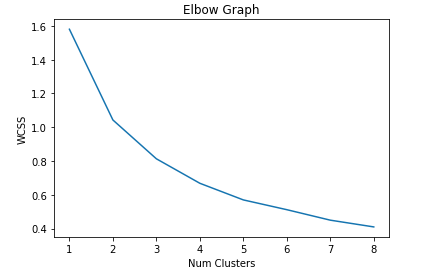
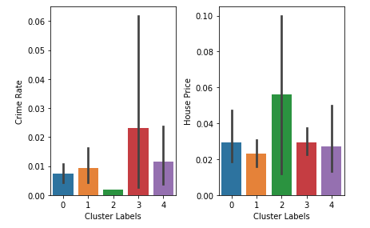
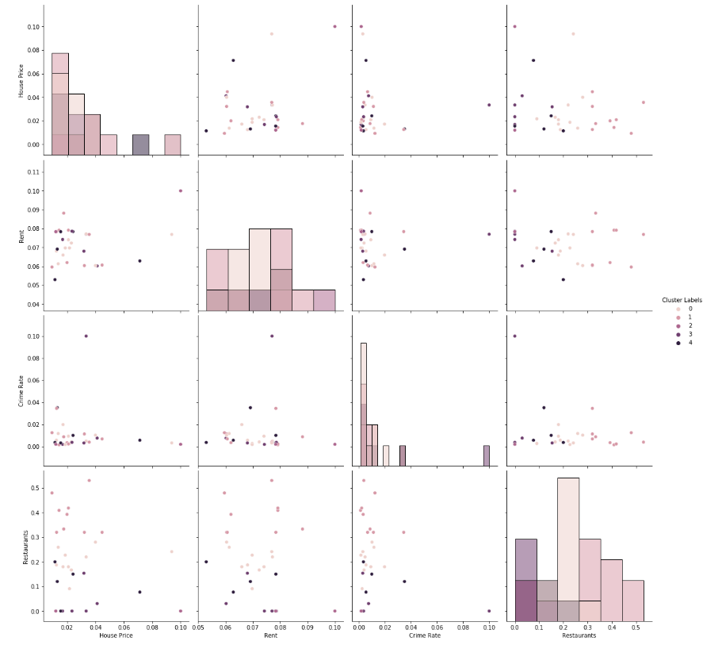
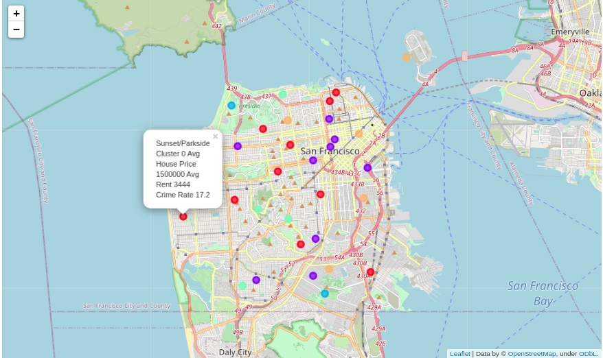

# Analysis of neighborhoods in San Francisco

## A. Introduction

### A.1. Description & Background

The city of San Franciso is the second most densly populated city in US and fifth most densly populated county in US. It covers 46.89 square miles of area and around 900,000 residents as of 2020. As of 2020, San Francisco has the highest salaries, disposable income, and median home prices in the world at $1.7 million, as well as the highest median rents. Like all big cities San Franciso has pockets of neighborhoods which are known for certain things like pubs, restaurants, schools, etc. The city keeps welcoming new residents every year and its population keeps growing.

One problem every new resident face when they come to the city is where to buy a house or rent one. This is a personal choice and can vary based on individuals. Like people with family and kids most likely are looking for good school disctricts, less crime rate while unmarried people who likes to have very social lifestyle might prefer staying in a neighborhood close to pubs, bars and restaurants. 

In this report we provide an analysis and categorization of different neighborhoods in the san francisco city based of different venues and average house price and median rents

### A.2 Data Descripton

To solve the above problem I use the below data

- list of different neighborhoods in San Fransisco city. I got this from data.sfgov.org. 
- I got the lattitude and longitude of the midpoint of each neighborhood from maps.google.com
- I am using the Foursquare API to get the details of the venues in each neighborhood
- I plan to merge this data with the san franciso house rent and price I scraped from www.bayareamarketreports.com website
- I also used data from sfgov.org to find the crime rates at different neighborhood

## B. Data Cleansing

As a repository I am using github. I used the resources in section A.2 to create a comma seperated file (CSV) of san francisco neigborhood comprrising of 'Lattitude', 'Longitude', 'House Price', 'Rent', 'Crime Rate'.

Next I used the Four Square API to get the venues near the neighborhoods. Since it generated a lot of information I decided categorize them in 11 categories like Restuarants, Stores, Shops, Bars, etc. Also normalize all the values between 0 and 1.

I then merge the 'Rent', 'House Price' and 'Crime Rate' columns to this data frame and also normalize them with respect to largest value of each column.

## C. Clustering

Here I use Kmeans clustering to finds clusters based of the different features for the san francisco neighborhood. I use the elbow method to find the best K for number of clusters which is five in my case. 
	

After getting the cluster labels I add them back to the dataframe as a column for each Neighborhood.

## D. Results

The results shows how Kmeans was able to cluster the different neighborhoods effectively. For example the plot below shows how Kmeans has captured the inverse relation between crime rate and house prices.

Here is a pairplot showing relation between different features

Finally I used folium map package in python to project these clusters over the san franciso city map and on the marker tip show relevant information like crime rate, average house price, etc.

## E. Conclusion

In this study I analyzed different neighborhoods in the san francisco metropolitian area. The compared different neighborhoods based on key preferences like proximity to stores, resturants and also things like crime rate, house prices, transportation, etc. I used unsuprevised learning and Kmeans for cluster these neigborhoods in categories based on their similarities. This method could give a lot of insight to realtors, new residents, tourists to find out information about different neigborhoods in san francisco based on their preferences. 
	